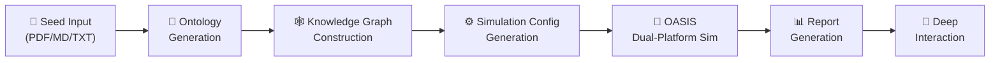
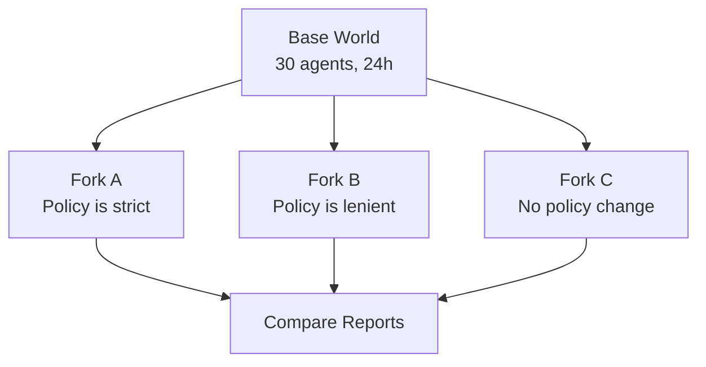

# MiroFish Backend Architecture Analysis

## Overview

**MiroFish** is a multi-agent swarm intelligence engine that builds parallel digital worlds to predict future outcomes. It extracts "seed" information (news, policy drafts, financial data, fiction), creates thousands of autonomous AI agents with unique personas, and simulates their social interactions on virtual Twitter/Reddit platforms — powered by the **OASIS** simulation engine from CAMEL-AI.

---

## Architecture: The 5-Phase Pipeline



### Phase 1 — Ontology Generation ([ontology_generator.py](file:///c:/Users/shriv/MiroFish/backend/app/services/ontology_generator.py))

- **1 LLM call** to analyze the input document and design 10 entity types (e.g., `Student`, `Professor`, `MediaOutlet`, `Person`, `Organization`) + 10 edge types (e.g., `WORKS_FOR`, `SUPPORTS`, `REPORTS_ON`)
- Output is a structured JSON ontology that defines what kinds of nodes and relationships the knowledge graph should extract
- Uses [chat_json()](file:///c:/Users/shriv/MiroFish/backend/app/utils/llm_client.py#70-103) with `max_tokens=4096`

### Phase 2 — Knowledge Graph Construction ([graph_builder.py](file:///c:/Users/shriv/MiroFish/backend/app/services/graph_builder.py))

- Text is chunked (500 chars, 50 overlap) and sent in batches of 3 to **Zep Cloud's** `graph.add_batch()` API
- Zep automatically extracts entities and relationships based on the ontology
- **No LLM tokens consumed** here — Zep handles the NLP extraction
- Creates a GraphRAG-style knowledge graph on Zep Cloud

### Phase 3 — Simulation Config Generation ([simulation_config_generator.py](file:///c:/Users/shriv/MiroFish/backend/app/services/simulation_config_generator.py))

Multiple LLM calls in a step-by-step strategy:

| Step | LLM Call | Purpose |
|------|----------|---------|
| 1 | Time Config | Design simulation duration (24-168h), round length, peak/off-peak hours (Chinese timezone) |
| 2 | Event Config | Generate initial posts, hot topics, narrative direction |
| 3-N | Agent Configs (batches of 15) | Activity level, posting frequency, sentiment bias, stance, active hours per agent |
| N+1 | Platform Config | Twitter/Reddit-specific weights |

**Per-agent profile generation** ([oasis_profile_generator.py](file:///c:/Users/shriv/MiroFish/backend/app/services/oasis_profile_generator.py)):
- **1 LLM call per agent** to generate a detailed 2000-char persona including: age, gender, MBTI, profession, speaking style, social media behavior, backstory
- Also enriched with Zep graph search (parallel edge/node queries) for additional context
- Each agent gets: bio, persona, karma, follower counts, interested topics

### Phase 4 — OASIS Dual-Platform Simulation ([run_parallel_simulation.py](file:///c:/Users/shriv/MiroFish/backend/scripts/run_parallel_simulation.py))

This is the **most token-intensive** phase:

- Runs **Twitter + Reddit simulations in parallel** as async tasks
- Each round:
  1. Time-based agent selection: only agents whose `active_hours` include the current simulated hour and pass a random `activity_level` check are activated
  2. **Each active agent makes 1 LLM call** via `LLMAction()` to decide their action (CREATE_POST, LIKE_POST, REPOST, COMMENT, FOLLOW, DO_NOTHING, etc.)
  3. Actions are recorded in SQLite databases and streamed to JSONL action logs
- Uses `semaphore=30` to limit concurrent LLM requests per platform
- Optionally updates the Zep knowledge graph with simulation activities in real-time

### Phase 5 — Report Generation ([report_agent.py](file:///c:/Users/shriv/MiroFish/backend/app/services/report_agent.py))

- **ReACT pattern** (Reasoning + Acting): the report agent plans an outline (2-5 chapters), then for each chapter:
  - Makes 3-5 tool calls (Zep deep search, panorama search, quick search, agent interviews)
  - Each tool call + reasoning = 1 LLM call
- Available tools search the post-simulation Zep graph for insights, facts, and agent quotes
- Can also **interview live agents** via the OASIS IPC server (real LLM-driven agent responses)

---

## Token Optimization Analysis

### What Optimizations Exist?

| Optimization | How It Works |
|---|---|
| **Time-based agent filtering** | Agents only act during their `active_hours`, with activity multipliers (0.05x at 2 AM, 1.5x at 9 PM). This significantly reduces LLM calls during off-peak hours |
| **Concurrency semaphore** | `semaphore=30` limits concurrent API calls per platform, preventing rate-limit errors but not reducing total calls |
| **LLM_BOOST dual API** | Optional second LLM endpoint — Reddit uses `LLM_BOOST_*` config while Twitter uses the main LLM. Distributes load across two API providers |
| **Batched config generation** | Agent configs are generated in batches of 15 in a single LLM call, rather than 1 call per agent |
| **Context truncation** | Document text is capped at 50,000 chars for ontology, 10,000 for time config, 8,000 for events, 3,000 for per-agent context |
| **Report tool call limits** | `REPORT_AGENT_MAX_TOOL_CALLS=5` and `REPORT_AGENT_MAX_REFLECTION_ROUNDS=2` cap the report agent's LLM usage |

### What's Missing (No Token Optimization)

> [!CAUTION]
> There is **no token-level caching, cost tracking, or response reuse** anywhere in the codebase.

- ❌ No prompt caching or response caching
- ❌ No token usage tracking or cost estimation
- ❌ No shared context between agents (each makes independent LLM calls)
- ❌ No "DO_NOTHING" shortcut — even "do nothing" decisions consume full LLM calls
- ❌ No smaller/cheaper model for simple decisions (e.g., LIKE vs. CREATE_POST)
- ❌ No batch API usage for agent decisions within a round

---

## Cost Estimation

### LLM Calls Per Simulation Run

For a simulation with **30 agents, 72 hours simulated, 60 min/round = 72 rounds, dual-platform**:

| Phase | LLM Calls | Explanation |
|------|-----------|-------------|
| Ontology | **1** | Single call to design entity/edge types |
| Profile Generation | **30** | 1 call per agent |
| Sim Config | **~5** | Time + Events + 2 agent batches + platform |
| Twitter Simulation | **~360-1080** | ~5-15 active agents × 72 rounds |
| Reddit Simulation | **~360-1080** | Same as Twitter |
| Report Generation | **~15-25** | 5 chapters × 3-5 tool calls |
| **Total** | **~770 - 2,200+** | |

### Token Usage Per LLM Call

| Call Type | Input Tokens (est.) | Output Tokens (est.) |
|-----------|-----|------|
| Agent action decision (OASIS) | ~1,500-3,000 (persona + feed context) | ~100-500 (action choice + content) |
| Profile generation | ~2,000-4,000 (entity context + prompt) | ~500-2,000 (persona JSON) |
| Report section | ~3,000-8,000 (context + tool results) | ~1,000-4,000 (section content) |
| Config generation | ~3,000-10,000 (document context) | ~500-2,000 (config JSON) |

### Cost Examples (using `qwen-plus` recommended model)

> [!NOTE]
> Alibaba's `qwen-plus` via Bailian Platform is the recommended model. Qwen-plus pricing (approx): ¥0.004/1K input tokens, ¥0.012/1K output tokens.

| Scenario | Agents | Rounds | Est. LLM Calls | Est. Cost |
|----------|--------|--------|-----------------|-----------|
| **Small test** (< 40 rounds) | 20 | 40 | ~400-800 | ¥2-8 ($0.3-1.1) |
| **Default** (72h, 60min/round) | 30 | 72 | ~800-2,200 | ¥5-20 ($0.7-2.8) |
| **Large scale** (168h) | 50 | 168 | ~3,000-10,000 | ¥20-80 ($2.8-11) |

If using **GPT-4o-mini** ($0.15/1M input, $0.60/1M output):

| Scenario | Est. LLM Calls | Est. Cost |
|----------|-----------------|-----------|
| Small test | ~400-800 | $0.10-0.50 |
| Default | ~800-2,200 | $0.25-1.50 |
| Large scale | ~3,000-10,000 | $1.00-5.00 |

If using **GPT-4o** ($2.50/1M input, $10/1M output):

| Scenario | Est. LLM Calls | Est. Cost |
|----------|-----------------|-----------|
| Small test | ~400-800 | $2-8 |
| Default | ~800-2,200 | $5-25 |
| Large scale | ~3,000-10,000 | $20-100 |

> [!WARNING]
> The README itself warns: *"High consumption — try simulations with fewer than 40 rounds first"*

---

## Key External Dependencies

| Dependency | Role | Cost |
|---|---|---|
| **LLM API** (OpenAI-compatible) | All agent reasoning, config gen, report writing | Pay-per-token |
| **Zep Cloud** | Knowledge graph storage, entity extraction, memory, GraphRAG search | Free tier available |
| **OASIS** (camel-ai) | Simulation engine: agent graphs, social platform environments | Open source, free |

---

## Summary

MiroFish's approach is straightforward but **token-expensive**: every agent decision during simulation is a full LLM call with the agent's persona and social feed as context. The only real cost optimization is the time-based agent activation filtering (fewer agents active at night). For production usage at scale, significant token optimization opportunities exist (caching, cheaper models for simple decisions, batch APIs, response sharing).

---

## Q&A

### Q1: How does it record trends from the agents' posts?

It does **not** directly extract "trends" as a keyword list. Instead, trends emerge organically from the raw actions, and are analyzed after the fact:

**During simulation — raw data collection:**

1. **SQLite databases** (`twitter_simulation.db`, `reddit_simulation.db`) store every action: posts, likes, reposts, comments, follows, with full content and metadata
2. **JSONL action logs** (`twitter_actions.jsonl`, `reddit_actions.jsonl`) stream each action with enriched context (e.g., "Agent X liked Agent Y's post about topic Z")
3. **Zep Graph Memory Updater** ([zep_graph_memory_updater.py](file:///c:/Users/shriv/MiroFish/backend/app/services/zep_graph_memory_updater.py)) runs a background thread that batches agent activities (every 5 actions) and feeds them back into the Zep knowledge graph as natural-language episodes. This means the graph evolves in real-time as agents interact

**After simulation — trend analysis:**

The **Report Agent** uses Zep search tools to mine trends:
- **InsightForge** — generates sub-questions from your query and does multi-dimensional search (semantic + entity + relationship chains) across the post-simulation graph
- **PanoramaSearch** — fetches ALL nodes and edges (including expired/historical facts) to see how opinions evolved over time
- **Agent Interviews** — directly asks live agents (via OASIS IPC) questions like "What do you think about X?", getting LLM-driven responses in-character

So trends are **inferred by the Report Agent's LLM** from the accumulated graph facts, agent posts, and interview responses — not computed by a separate analytics module.

---

### Q2: Single world or multiple worlds per question?

**One question = one simulation run = one dual-platform world.**

Each simulation creates exactly **two parallel sub-worlds**:
- **World 1 (Twitter)** — agents post, like, repost, quote, follow
- **World 2 (Reddit)** — agents post, comment, upvote/downvote, search, follow

Both worlds share the **same agents** (same personas) but run independently with their own SQLite databases, action logs, and LLM model instances. The code in [run_parallel_simulation.py](file:///c:/Users/shriv/MiroFish/backend/scripts/run_parallel_simulation.py) launches both as concurrent async tasks.

If you want to test the same scenario with **different variables** (e.g., "What if the policy is stricter?"), you must start a **completely new simulation** — there is no built-in mechanism for branching or forking a world mid-run.

> [!NOTE]
> The platform names are labeled internally as `世界1` (World 1 = Twitter) and `世界2` (World 2 = Reddit) in the Chinese UI.

---

### Q3: Won't posting on X/Reddit get the IP suspended?

**No risk at all — nothing touches real X (Twitter) or Reddit.**

The simulation is **100% local and self-contained**:

- OASIS creates an **in-memory simulated platform** with its own database (SQLite), its own user table, post table, comment table, follow table, etc.
- Agents interact with this **fake Twitter/Reddit** that exists only as Python objects and SQLite rows on your machine
- The only external network calls are:
  1. **LLM API** (OpenAI-compatible endpoint) — for agent reasoning
  2. **Zep Cloud API** — for knowledge graph storage
- **Zero calls** to twitter.com, x.com, reddit.com, or any social media API

```
Agent → LLM API ("What should I post?") → LLM responds → OASIS writes to local SQLite
                                                          ↑ This is the "Twitter/Reddit"
```

So there's no risk of IP suspension, API bans, or Terms of Service violations. The simulated social media platforms are entirely virtual — they're just database tables that mimic real platform structures.

---

### Q4: What determines the behavior/property of a particle (agent/node) that decides its outputs?

An agent's output (post, like, comment, do nothing, etc.) is determined by a **layered combination of factors**:

**1. Persona Profile (the agent's DNA)**

Each agent is assigned a rich persona via [oasis_profile_generator.py](file:///c:/Users/shriv/MiroFish/backend/app/services/oasis_profile_generator.py) — a ~2000-character personality blueprint generated by a single LLM call. This includes:
- **Demographics:** age, gender, profession, location
- **Psychological traits:** MBTI type, sentiment bias (optimistic/pessimistic/neutral), stance on the topic
- **Behavioral parameters:** speaking style, social media habits, preferred content types
- **Backstory:** personal history that motivates their worldview

This persona is injected as a **system prompt** into every LLM call the agent makes, so it colors all decisions.

**2. Simulation Config Parameters (the rules of engagement)**

Set during Phase 3 via [simulation_config_generator.py](file:///c:/Users/shriv/MiroFish/backend/app/services/simulation_config_generator.py):
- **`activity_level`** (0.0–1.0) — probability of acting in any given round (a lazy agent with 0.2 acts rarely)
- **`active_hours`** — which hours of the day the agent is online (night owls vs. early risers)
- **`posting_frequency`** — how often they create original posts vs. just react
- **`sentiment_bias`** — numerical weight pushing the agent toward positive, negative, or neutral actions

**3. Knowledge Graph Context (the agent's awareness)**

Before profile generation, Zep graph queries pull related entities and relationships from the knowledge graph. An agent linked to a `University` node gets academic context; one linked to `MediaOutlet` gets journalistic framing. This **graph-enriched context** shapes what the agent knows and cares about.

**4. Social Feed Context (the agent's environment)**

Each round, OASIS feeds the agent a curated content feed (recent posts from followed users + recommended content via hot-score). The agent's LLM call receives this feed as input, so **what other agents have posted directly influences** the current agent's decision — creating emergent social dynamics.

**5. Time-Based Activation (the clock filter)**

The OASIS time engine applies hourly activation probabilities (e.g., 0.05x at 2 AM, 1.5x at 9 PM Chinese timezone). An agent that passes the time filter and the `activity_level` random check gets activated; otherwise, it silently skips the round.

**In summary:** the agent's output is the result of:

```
Output = LLM(persona_prompt + graph_context + social_feed + topic_prompt)
         × activity_level_check
         × time_activation_check
```

The **persona** defines *who* the agent is, the **config** defines *how active* it is, the **graph** defines *what it knows*, and the **feed** defines *what it's reacting to*. The LLM synthesizes all of these into a single action decision each round.

---

## MiroFish vs. OASIS Comparison

**MiroFish uses OASIS (`camel-oasis==0.2.5`) as a dependency — it's not a fork or rewrite.** Here's how they relate:

### What OASIS Provides (the engine)

| Feature | OASIS Handles It |
|---|---|
| Simulated Twitter/Reddit platforms | ✅ Environment server with SQLite backend |
| Agent graph creation | ✅ `generate_twitter_agent_graph()`, `generate_reddit_agent_graph()` |
| LLM-powered agent decisions | ✅ `LLMAction()` — each agent calls LLM to choose actions |
| Manual action injection | ✅ `ManualAction()` — force specific agent actions |
| Available action types | ✅ 21+ actions (CREATE_POST, LIKE, REPOST, COMMENT, FOLLOW, TREND, etc.) |
| Recommendation system | ✅ Interest-based + hot-score content feeds |
| Time engine | ✅ Hourly activation probabilities |
| Concurrency control | ✅ Semaphore-based parallel LLM calls |
| Agent interviews | ✅ `ActionType.INTERVIEW` for in-character Q&A |
| Data storage | ✅ SQLite databases for all platform data |

### What MiroFish Adds On Top (the application layer)

| Feature | MiroFish's Addition | OASIS Equivalent |
|---|---|---|
| **Knowledge Graph** | Zep Cloud integration — builds a GraphRAG knowledge graph from seed documents | ❌ OASIS has no document ingestion |
| **Ontology Design** | LLM auto-designs entity/relationship types from input text | ❌ OASIS doesn't build knowledge models |
| **Intelligent Agent Profiles** | LLM + Zep graph enrichment generates 2000-char personas with MBTI, backstory, speaking style | OASIS takes pre-made CSV/JSON profiles |
| **Auto Config Generation** | LLM designs simulation parameters (duration, events, agent behavior) from a text prompt | OASIS requires manual configuration |
| **Real-Time Graph Updates** | `ZepGraphMemoryUpdater` streams agent actions back into the knowledge graph during simulation | ❌ OASIS only stores to SQLite |
| **ReACT Report Agent** | Generates multi-chapter prediction reports using graph search tools + agent interviews | ❌ OASIS provides raw data only |
| **Dual-Platform Parallel Runs** | Runs Twitter + Reddit simultaneously with optional `LLM_BOOST` dual-API | OASIS runs one platform at a time |
| **Action Logging** | Rich JSONL action logs with enriched context (post content, author names) | OASIS logs to SQLite trace table |
| **Web API** | Flask REST API for frontend integration | OASIS is a Python library only |
| **IPC Server** | Inter-process communication for live agent interviews during/after simulation | ❌ Not in OASIS |

### Layered Architecture

```
┌─────────────────────────────────────────────────┐
│              MiroFish (Application)              │
│  • Document → Knowledge Graph → Agent Profiles  │
│  • Auto config generation                       │
│  • Real-time Zep graph memory updates            │
│  • ReACT report agent with Zep tools            │
│  • Flask API + IPC server                       │
│  • Dual-platform orchestration                   │
├─────────────────────────────────────────────────┤
│              OASIS (Simulation Engine)           │
│  • Simulated Twitter/Reddit platforms            │
│  • LLM-powered agent decisions                  │
│  • Recommendation system                        │
│  • SQLite data storage                          │
│  • Agent graphs + action types                  │
├─────────────────────────────────────────────────┤
│              CAMEL-AI (LLM Framework)            │
│  • ModelFactory for LLM integration             │
│  • OpenAI-compatible API wrapper                │
└─────────────────────────────────────────────────┘
```

**OASIS** = the simulation engine (agents + platforms + actions + SQLite)  
**MiroFish** = the full-stack application that wraps OASIS with document understanding, knowledge graphs, automated configuration, report generation, and a web interface.

---

## Real-Life Use Cases

Here are practical scenarios where you can apply the MiroFish/OASIS pattern in your own projects:

### 1. 🏛️ Policy Impact Prediction

**Scenario:** A government is drafting a new education policy. Feed the draft as seed text → agents become students, teachers, parents, administrators, media → simulate how each stakeholder reacts on social media → get a prediction report before the policy is announced.

**Your angle:** Build a SaaS tool for policy analysts — they upload a draft, get a simulated public reaction report in 30 minutes. Charge per simulation run.

### 2. 📈 Product Launch War-Gaming

**Scenario:** Before launching a product, simulate how your target market (tech enthusiasts, budget shoppers, enterprise buyers) would react. Feed your press release + competitor data → agents become potential customers, reviewers, influencers → predict viral topics, objections, and sentiment.

**Your angle:** Integrate with marketing tools. Teams run 5-10 simulations with different pricing/positioning, compare the simulated social media buzz, and pick the best launch strategy.

### 3. 💰 Financial Market Sentiment Modeling

**Scenario:** Feed breaking financial news (interest rate hike, earnings report, CEO resignation) → agents become retail investors, institutional traders, analysts, financial journalists → simulate how sentiment spreads across social platforms → predict market reaction before it happens.

**Your angle:** Build a real-time layer that ingests live financial news feeds and runs rapid simulations (10-20 rounds) to give traders early sentiment signals.

### 4. 🎮 Game Narrative Testing

**Scenario:** A game studio has written a story with branching paths. Feed the story as seed → agents become players with different personas → simulate which paths they choose, what they discuss → identify boring or confusing story branches before production.

**Your angle:** A testing tool for narrative designers. Upload your game script, get a simulated focus group of 50 diverse "players" testing your story.

### 5. 🏥 Public Health Campaign Simulation

**Scenario:** Before launching a vaccination campaign, simulate how different demographics react. Feed campaign messaging → agents become healthcare workers, anti-vax groups, parents, elderly → predict where misinformation might spread → adjust messaging before launch.

**Your angle:** A tool for public health organizations to A/B test their messaging in simulation before spending real campaign budgets.

### 6. 📰 Misinformation Spread Analysis

**Scenario:** A research institution wants to study how fake news spreads. Inject a false claim into the simulation → observe how agents share, debunk, or amplify it → measure viral spread patterns → test counter-narrative strategies.

**Your angle:** Build a research platform for universities studying information warfare, with built-in analytics dashboards.

### 7. Social media trend checker

**Scenario:** A content creator wants to check the virality of their content. They can use this tool to simulate how their content would spread across social media platforms. They can also use this tool to identify potential influencers who might be interested in their content. They can check backslash or anything and be prepared for it in advanced.


---

## Building Your Own Improved Engine

If you want to build something inspired by MiroFish but better, here's a concrete improvement roadmap:

### Improvement 1: Tiered LLM Strategy (biggest cost saver)

MiroFish uses the **same model for everything**. Instead, use a 3-tier approach:

```
┌─────────────────────────────────────────────┐
│  Tier 1: Heavy Model (GPT-4o / Claude)      │
│  → Ontology design, report generation       │
│  → ~5-10 calls per simulation               │
├─────────────────────────────────────────────┤
│  Tier 2: Mid Model (GPT-4o-mini / Qwen)     │
│  → Profile generation, config generation    │
│  → ~30-50 calls per simulation              │
├─────────────────────────────────────────────┤
│  Tier 3: Cheap/Local Model (Llama 3 / Phi)  │
│  → Agent action decisions during simulation │
│  → ~1,000-5,000 calls per simulation        │
│  → Run locally with Ollama = $0 cost        │
└─────────────────────────────────────────────┘
```

**Impact:** 80-90% cost reduction. Agent action decisions are simple (pick from 10 actions) and don't need GPT-4o.

### Improvement 2: DO_NOTHING Classifier

Before calling the LLM, use a **lightweight rule-based classifier** to decide if an agent should even act:

```python
def should_agent_act(agent, current_feed):
    # Skip if no relevant content in feed
    if not any(topic in current_feed for topic in agent.interests):
        return False  # → DO_NOTHING without LLM call
    # Skip if agent acted recently
    if agent.last_action_round >= current_round - 1:
        return False
    return True  # → Call LLM
```

**Impact:** 30-50% fewer LLM calls per round.

### Improvement 3: Response Caching with Semantic Matching

Cache LLM responses and reuse when similar contexts appear:

```python
cache_key = hash(agent.persona_summary + feed_summary[:200])
if cache_key in response_cache:
    return response_cache[cache_key]  # Skip LLM call
```

**Impact:** 10-20% fewer calls, especially for agents with repetitive feeds.

### Improvement 4: Multi-World Forking

MiroFish creates one world per question. Instead, support **branching**:



Save the world state at any round and fork it with different injected variables. Compare outcomes across forks.

### Improvement 5: Real-Time Analytics Dashboard

MiroFish only generates a report after the simulation ends. Instead, build a **live dashboard**:

- Sentiment score per round (positive/negative/neutral post ratio)
- Topic clustering (what agents are talking about)
- Influence network graph (who is getting the most engagement)
- Viral content tracker (which posts are getting the most reposts)
- Agent stance shifts over time

Use simple NLP (keyword matching, VADER sentiment) on the SQLite data — no LLM needed.

### Improvement 6: Custom Platform Types

MiroFish is locked to Twitter + Reddit. Build a platform abstraction layer:

- **WhatsApp-style** — private groups, forwarded messages, no public feed
- **LinkedIn-style** — professional Network, job posts, article sharing
- **Discord-style** — channels, threads, reactions, voice chat sentiment
- **News Forum** — upvote/downvote, threaded comments, subreddit-like communities

Each platform type changes how information flows, giving very different simulation dynamics.

### Improvement 7: Self-Hosted Knowledge Graph

Replace Zep Cloud with a **self-hosted graph database** (Neo4j, or even simple NetworkX):

- No external dependency or cloud costs
- Full control over entity extraction (use your own NER model)
- Can handle larger graphs without API rate limits
- Offline-capable simulations

### Improvement 8: Token Budget System

Add a **budget-aware simulation runner**:

```python
class TokenBudgetManager:
    def __init__(self, max_budget_usd: float, model_pricing: dict):
        self.remaining_budget = max_budget_usd
        self.total_input_tokens = 0
        self.total_output_tokens = 0

    def can_afford(self, estimated_tokens: int) -> bool:
        cost = self.estimate_cost(estimated_tokens)
        return cost <= self.remaining_budget

    def on_llm_response(self, usage):
        self.total_input_tokens += usage.input_tokens
        self.total_output_tokens += usage.output_tokens
        self.remaining_budget -= self.calculate_cost(usage)
```

Set a max budget (e.g., $5), and the simulation automatically adjusts: reduces active agents, shortens rounds, or switches to cheaper models when the budget runs low.

---

### Recommended Tech Stack for Your Own Engine

| Component | Recommendation | Why |
|---|---|---|
| **Simulation Engine** | OASIS (camel-ai) or custom | OASIS is battle-tested; custom gives more control |
| **LLM Framework** | LiteLLM or OpenAI SDK | LiteLLM supports 100+ providers with one API |
| **Local LLM** | Ollama + Llama 3.1 8B | Free, fast, good enough for agent decisions |
| **Knowledge Graph** | Neo4j or NetworkX | Self-hosted, no cloud dependency |
| **Backend** | FastAPI (not Flask) | Async-native, better for concurrent LLM calls |
| **Frontend** | Next.js + shadcn/ui | Modern, real-time dashboard capabilities |
| **Database** | PostgreSQL + SQLite | Postgres for app state, SQLite for simulation data |
| **Queue** | Redis + Celery | For managing simulation jobs and background tasks |